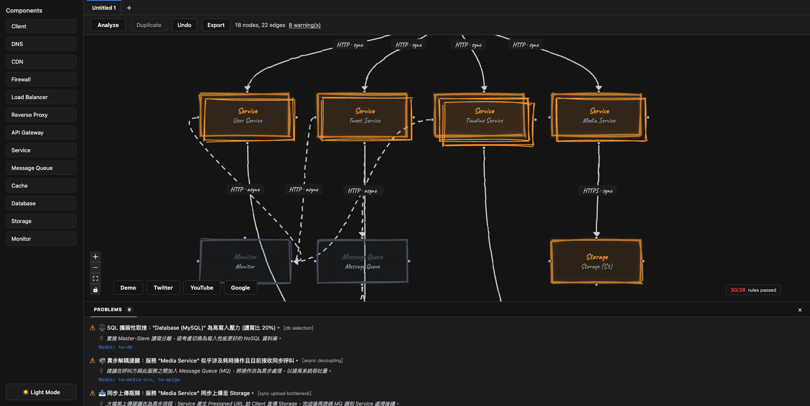

# ArchitectMind: 系統設計視覺化工具 (System Design Visualizer)



ArchitectMind 是一個網頁版的系統架構繪圖與分析工具。它提供了一個直觀的互動式畫布 (Canvas)，讓使用者可以拖放各種基礎設施組件（如 Load Balancer, Database, Service 等），並透過後端 API 進行架構邏輯的語法驗證與最佳實踐建議。

## 🚀 功能特點

- **互動式畫布**：基於 React Flow v12，支援節點拖放、連線與自定義屬性。
- **組件側邊欄**：提供標準的系統設計組件庫（Client, CDN, API Gateway, Message Queue 等）。
- **後端語法驗證 (Analyze)**：支援 38+ 項自動化規則，檢查架構圖中的組件類型與連線邏輯是否符合系統設計最佳實踐。
- **多頁籤支援 (Tabs)**：支援同時開啟多個設計畫布，方便進行架構對比與多專案並行。
- **一鍵生成預設架構 (Presets)**：提供經典系統設計模板（Standard Demo, Twitter, YouTube, Google），協助快速上手。
- **導出功能 (Export)**：支援導出為 Excalidraw, Image, Mermaid 與 PDF 格式。
- **快捷操作**：支援 **Duplicate** (複製)、**Undo** (還原) 以及 **Merge/Split** (合併/拆分) 功能，提升繪圖效率。
- **響應式設計**：支援深色模式 (Dark Mode)，簡潔現代的使用者介面。

## 🛠 技術棧

### 前端 (Frontend)

- **React 19** + **TypeScript**
- **Vite** (開發與構建工具)
- **React Flow (@xyflow/react v12)** (畫布引擎)

### 後端 (Backend)

- **Go 1.25+**
- **Gin Web Framework** (API 路由)
- **MongoDB** (預留資料持久化介面)

## 📦 安裝與運行步驟

### 1. 快速啟動 (Quick Start)

專案根目錄提供了一個便利的腳本，可同時啟動後端與前端開發伺服器：

```bash
chmod +x start-dev.sh
./start-dev.sh
```

啟動後：

- 前端：`http://localhost:5173`
- 後端：`http://localhost:8080`

## ✅ 測試 (Tests)

目前測試集中於後端。請在 `api` 目錄下執行：

```bash
cd api
go test ./... -v
```

## 🔍 架構驗證規則範例 (Validation Rules)

後端目前實作了超過 38 項進階架構驗證規則，完整清單請參閱 [api/RULES.md](./api/RULES.md)。規則涵蓋：

- **Availability**: 單點故障檢查 (SPOF)、LB/API Gateway 冗餘驗證、Health Check 配置。
- **Performance**: 讀寫分離建議、快取一致性與失效策略、CDN 全球加速建議。
- **Security**: `invalid_connection` (偵測不合理的元件連線方向，如 DB→Client、LB→Database、DNS→Service 等)、Firewall/WAF 缺失檢查。
- **Scalability**: 異步解耦 (MQ)、流量削峰建議、資料庫垂直切分提醒。
- **Observability**: Logger/Monitor 缺失檢查、告警配置驗證。

## 📂 專案結構

- `/frontend`: 包含 React 原始碼、React Flow 組件、自定義 Hook 與 API 調用邏輯。
- `/api`: 包含 Go API 處理程序 (Handlers)、數據模型 (Models) 與驗證引擎。
